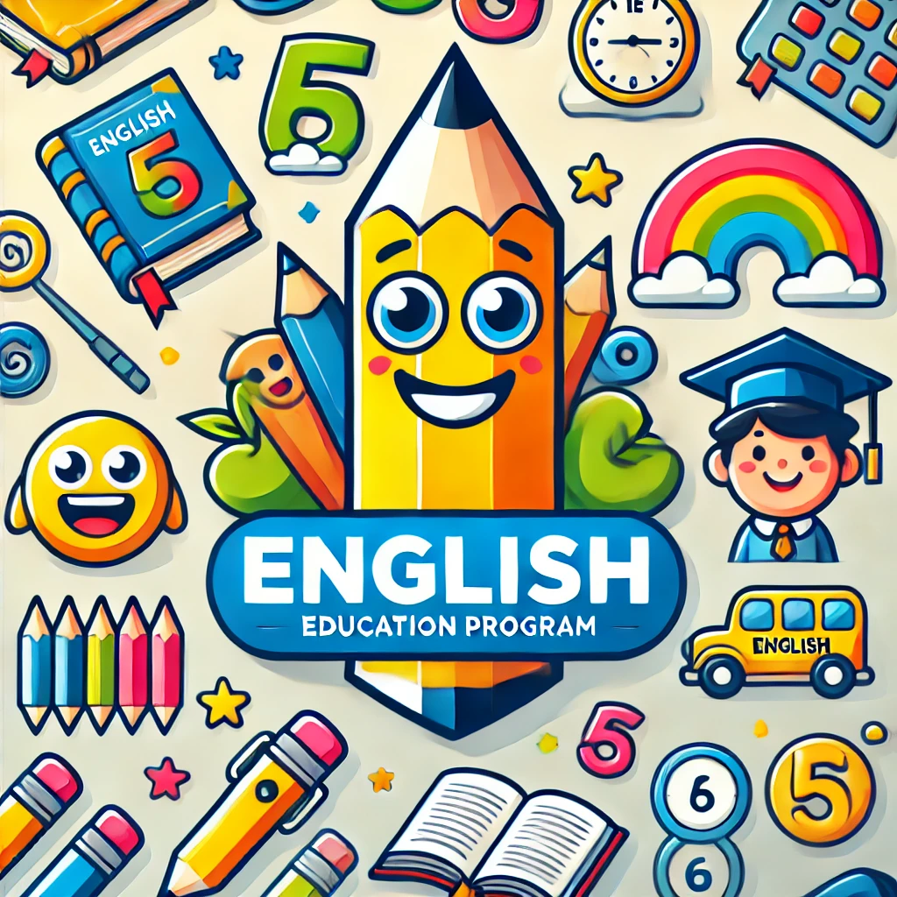

# 초등학생을 위한 영어 학습 웹 애플리케이션

<p align="center">
  
</p>

이 프로젝트는 [Next.js](https://nextjs.org)를 기반으로 한 초등학교 5, 6학년을 대상으로 하는 영어 학습 웹 애플리케이션입니다.

## 시작하기

먼저, 개발 서버를 실행하세요:

```bash
npm run dev
# or
yarn dev
# or
pnpm dev
# or
bun dev
```

브라우저에서 [http://localhost:3000](http://localhost:3000)을 열어 결과를 확인하세요.

## 주요 기능

- OpenAI API를 활용한 맞춤형 영어 학습
- 음성 인식 및 텍스트 음성 변환 기능
- 한국어 ↔ 영어 번역 기능
- 학습 진행 상황 시각화
- 사용자 친화적인 UI (shadcn UI 사용)

## 사용된 주요 기술

- Next.js
- TypeScript
- OpenAI API
- DeepL API
- Supabase
- React Query
- Framer Motion
- Chart.js
- i18next
- shadcn UI
- Tailwind CSS

## 라이선스

이 프로젝트는 Apache 라이선스를 따르고 있습니다. 자세한 내용은 [LICENSE](LICENSE) 파일을 참고하세요.
